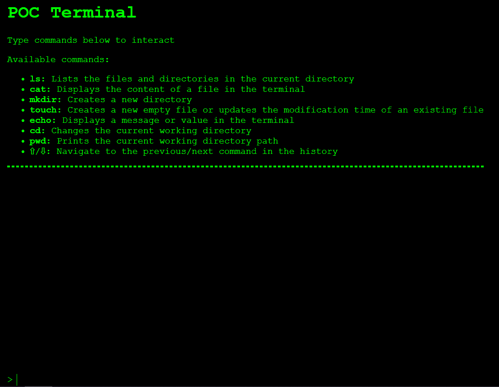

# POC | Terminal



> Project allows you to use a basic Linux terminal that supports essential commands like `ls`, `cat`, `mkdir`, `touch`, `echo`, `cd` and `pwd`.

### The project use React.js for frontend and Fastapi for a basic API

## 🚀 Installing and running the project
To install and run the project locally, follow these steps:

```bash
### FRONTEND ###
npm install
npm run dev

### BACKEND ###
python -m virtualenv venv 
source venv/bin/activate
pip install -r requirements.txt
uvicorn api:app
```

The project will be running at `http://localhost:5173/`